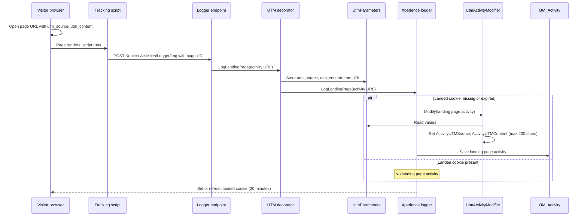

# Usage Guide

## Setup

1. Install the `Kentico.Xperience.Labs.SimpleStats.Admin` NuGet package in your Xperience by Kentico web project.
2. Run the application. No service registration is needed; the library registers its services and admin UI automatically.

## Application

The library adds the **Simple Stats (Labs)** application to the **Digital marketing** category.

## Navigation

Reports are grouped into sections. Opening the application or a section opens its first report the role may see.

| Section  | Reports                                                                                                                                                                 |
| -------- | ----------------------------------------------------------------------------------------------------------------------------------------------------------------------- |
| Contacts | Activity counts, Top pages, Campaign sources, New contacts, Form submissions, Member registrations, Consents                                                            |
| Emails   | Email summary, Recipient lists                                                                                                                                          |
| Content  | Content inventory, Publishing calendar, Content locks, Page freshness, Reusable content usage, Publishing activity, Translation status, Editor contributions, Tag usage |
| Commerce | Orders and revenue, Customers                                                                                                                                           |
| System   | Event log                                                                                                                                                               |

Sections have no permission of their own. A section is hidden when the role has no permission for any of its reports. A role with **View** but no report permission sees a **No reports available** message.

## Permissions

- Administrators see the application and all reports by default.
- For other roles, open **Role management**, select the role, and edit its permissions for **Simple Stats (Labs)**:
  - **View** - opens the application.
  - One permission per report. The role sees only the reports it has a permission for. Other reports are hidden from the navigation and return an error if opened by URL.
  - **Export** - shows the **Export CSV** buttons in all reports the role can see. Without it, the buttons are hidden.

| Permission             | Code name                         |
| ---------------------- | --------------------------------- |
| Activity counts        | `SimpleStats.ActivityCounts`      |
| Top pages              | `SimpleStats.TopPages`            |
| Campaign sources       | `SimpleStats.CampaignSources`     |
| New contacts           | `SimpleStats.NewContacts`         |
| Form submissions       | `SimpleStats.FormSubmissions`     |
| Content inventory      | `SimpleStats.ContentInventory`    |
| Publishing calendar    | `SimpleStats.PublishingCalendar`  |
| Content locks          | `SimpleStats.ContentLocks`        |
| Page freshness         | `SimpleStats.PageFreshness`       |
| Reusable content usage | `SimpleStats.ReusableUsage`       |
| Publishing activity    | `SimpleStats.PublishingActivity`  |
| Translation status     | `SimpleStats.TranslationStatus`   |
| Editor contributions   | `SimpleStats.EditorContributions` |
| Tag usage              | `SimpleStats.TagUsage`            |
| Event log              | `SimpleStats.EventLog`            |
| Orders and revenue     | `SimpleStats.OrdersRevenue`       |
| Customers              | `SimpleStats.Customers`           |
| Member registrations   | `SimpleStats.Members`             |
| Consents               | `SimpleStats.Consents`            |
| Email summary          | `SimpleStats.EmailSummary`        |
| Recipient lists        | `SimpleStats.RecipientLists`      |
| Web page stats         | `SimpleStats.WebPageStats`        |
| Contact stats          | `SimpleStats.ContactStats`        |
| Export                 | `SimpleStats.Export`              |

The **Export** permission only hides the buttons. The CSV is built in the browser from the data the report already shows, so a role that can see a report can still copy its numbers. It is not data protection.

## Reports

### Activity counts

Shows contact activities per activity type over time as a stacked column chart.

- **KPIs** - total activities, top activity type, and number of activity types in the range.
- **Filters**
  - **Date range** - last 7, 30 or 90 days, or a custom range (up to about 5 years).
  - **Group by** - day, week (weeks start on Monday) or month.
  - **Channel** - all channels, or one website or email channel (uses the activity channel).
- **Chart / table** - switch the tile to a table with the exact numbers.
- **Export CSV** - downloads the table as a CSV file.

### Top pages

Shows the 25 most visited page URLs in the range as a bar chart, largest on top.

- **KPIs** - total page visits, number of distinct page URLs, and the top page.
- **Filters** - date range and website channel (no grouping).
- **Chart / table** - the table lists rank, URL (opens the page in a new tab), visits, unique contacts and share of all page visits in the range.
- **Export CSV** - downloads the list as a CSV file.

Visits are grouped by the logged URL with the query string and fragment removed, so `/page?utm_source=x` counts as `/page`. Other differences (host, trailing slash, letter case) count as different pages.

### Campaign sources

Shows which pages get the most traffic from a UTM source (and content), and how campaign landings change over time. Uses the UTM values stored on landing page activities. Xperience does not store them by itself; see [UTM capture (optional)](#utm-capture-optional) for sample code that does.

- **Definitions** - the same as on the [Stats (Labs) tab](#campaign-sources-on-the-stats-labs-tab): **landings** (landing page activities, about the sessions that started on a page), **campaign landings** (landings with a UTM source), **campaign share**, **source**, **content** ("(none)" when empty) and **visitors** (distinct contacts).
- **Filters**
  - **Date range**, **Group by** and **Channel** (website channels; uses the activity channel).
  - **Source** - all sources, or one of the sources with campaign landings in the range.
  - **Content** - shown when a source is selected: all contents, one content, or "(none)".
- **KPIs** - landings (all, with or without UTM values), campaign landings of the selected source and content, campaign share with the number of visitors, and the number of sources. Landings, campaign landings and sources are compared with the previous period of the same length.
- **Tiles**
  - "Top landing pages" - pages where campaign landings of the selected source and content started: page name, channel and language, campaign landings, visitors and share. The page name opens the page on the website in a new tab (the logged URL without query string). Up to 25 pages. A page that no longer exists shows its URL.
  - "Top sources" - campaign landings per source with visitors, the previous period and the change. Always all sources (the source filter does not apply). Up to 10 sources.
  - "Source and content" - campaign landings and visitors per source and content, for the selected source (the content filter does not apply). Up to 25 pairs.
  - "Campaign landings over time" - stacked by the top 5 sources, the rest as "Other". Follows the source and content filter.
- **Empty states** - "No UTM values are stored on this site" when no activity in the database has a UTM source, and "No campaign landings" when the site has UTM values but the filter has none in the range.
- **Export CSV** - each tile has its own export: `campaign-sources-pages`, `campaign-sources-sources`, `campaign-sources-content`, `campaign-sources-series`.

`utm_medium` and `utm_campaign` are not stored (no activity column). Put the campaign or creative name in `utm_content` to tell campaigns of one source apart. Conversions after a campaign landing (for example form submissions) are not shown. Contact and activity cleanup deletes old landings too (see [Data retention](#data-retention)).

### Web page stats

A **Stats (Labs)** tab on each web page in website channels (after the page's other tabs). Shows contact activities logged for that page in the language being edited, as a stacked column chart per activity type, and the campaign sources (UTM values) of the page's landings.

- **KPIs** - page visits, unique visitors (distinct contacts with a page visit), form submissions (with distinct submitters and their share of unique visitors), and total activities with the number of distinct contacts.
- **Filters** - date range and grouping (no channel: the page belongs to one channel).
- **Chart / table** - switch the tile to a table with the exact numbers.
- **Export CSV** - downloads the table as a CSV file.
- **Campaign sources** - below the activities. See [Campaign sources](#campaign-sources-on-the-stats-labs-tab).

Activities are matched by the web page they were logged for (`ActivityWebPageItemGUID`) and the language. Only counts are shown; no contact details.

Form submission activities have no web page link or language, so they are matched by URL instead: the logged `ActivityURL` against the current live URL of the page variant (the channel home page is `/`, or `/{language}` for other languages), in the page's channel. The host, query string, fragment and a trailing slash are ignored; letter case follows the database collation (case-insensitive by default). Limits:

- Submissions made under a former URL of the page (before it was moved or renamed) are not counted.
- A page without a live URL (never published) shows no form submissions.
- Channels with [language-specific domains](https://docs.kentico.com/documentation/developers-and-admins/configuration/website-channel-management#configure-language-specific-domains) use the same paths for all languages, so the URL host must also match: the domain and aliases configured for the edited language in `WebsiteChannelDomains:LanguageDomains` of the running environment (host and port, letter case ignored). If the language has no domain configured, the host is not checked and submissions of all languages on the same path are counted together; the tooltip says so.
- Domains are read from the configuration of the environment that runs the admin. Activities logged under other hosts (for example production data copied to a local database) are not matched on language-domain channels.
- Language prefix channels ignore the host, because the path already includes the language. The tab requires the **Web page stats** permission of **Simple Stats (Labs)** (not the **View** permission of the application) and is hidden on the channel root.

#### Campaign sources on the Stats (Labs) tab

Shows which campaigns bring visitors to the page. Uses the UTM values stored on landing page activities. Xperience does not store them by itself; see [UTM capture (optional)](#utm-capture-optional) for sample code that does.

- **Definitions**
  - **Landings** - landing page activities of the page variant in the range, matched by page and language like the other activities. A landing page activity is logged for the first page of a browsing session, so landings are about the sessions that started on this page.
  - **Campaign landings** - landings with a UTM source (`utm_source`). **Campaign share** - campaign landings / landings.
  - **Source** - the stored UTM source, trimmed. **Content** - the stored UTM content (`utm_content`), or "(none)" when empty. Values that differ only in letter case are counted together (default database collation).
  - **Visitors** - distinct contacts.
- **KPIs** - landings, and campaign landings with their share of landings and the number of distinct contacts.
- **Tiles**
  - "Campaign sources" - campaign landings per source: bar chart, or a table (source, landings, visitors, share of campaign landings). Up to 10 sources.
  - "Source and content" - table (source, content, landings, share of campaign landings). Up to 25 pairs.
- **Empty states** - "No UTM values are stored on this site" when no activity in the database has a UTM source (UTM capture is not set up), and "No campaign landings on this page" when the site has UTM values but this page has none in the range.
- **Export CSV** - each tile has its own export: `web-page-stats-campaign-sources` and `web-page-stats-campaign-content`.

`utm_medium` and `utm_campaign` are not stored (no activity column), so they are not shown.

### Contact stats

A **Stats (Labs)** tab on each contact in **Contact management** (after the contact's other tabs). The product's **Activities** tab is a plain list; this tab shows the same contact's activities as trends and short insights. Only that one contact's data is shown, aggregated.

- **Filters** - date range with an **All time** preset (default: from the contact's creation or its first activity, whichever is earlier, to today), grouping, and **Activity types** (several can be selected; none selected means all). The type options are the types this contact has. The type filter applies to every KPI, tile and insight; a tile whose activity type is not selected shows a short message instead of data. No channel filter.
- **Insights** - short lines built from the numbers (no AI), shown only when they apply: "Active on N of the last M days" (or "Not seen for N days" when the newest activity is more than 30 days old), "Activity up/down X% vs previous N days" (not for All time), "Most visited: page", "Top interest: tag (taxonomy)" (else the top content type), "Came from source in N of M sessions" (with UTM data), "Submitted form N times" (the most recently submitted form).
- **KPIs** - activities (with the change vs the previous period of the same length; not for All time), sessions (landing page activities: one per browsing session), active days (distinct days with any activity), last seen (newest activity of the selected types, any date).
- **Tiles**
  - "Activity over time" - activities per period, stacked by type.
  - "When active" - activities by weekday and hour (server time zone). Switch hour labels between 24h and 12h; the CSV always uses 0-23. Not loaded with the tab: select **Generate heatmap**. After that it follows filter changes and **Refresh** until the page is reloaded.
  - "Pages visited" - page visits per page and language, with the channel. Links open the live page.
  - "Forms submitted" and "Emails clicked" - submissions per form and clicks per email, with the last date. Links open the form's submissions and the email's statistics. Deleted forms and emails show as "(deleted form)" / "(deleted email)".
  - "Campaign sources" - sessions per UTM source and content. Shown only when the site stores UTM values (see [UTM capture (optional)](#utm-capture-optional)).
  - "Interests" - switch between **Tags** (default) and **Content types**. Tags: page visits per tag of the visited page and of the items its published version links to (one level, including images), in the visit's language (else another language variant of the item). A visit counts once per tag, so the numbers do not add up. Filter by **Taxonomy** to focus. Content types: page visits per content type of the visited page. Pages that no longer exist are left out of both.
- **All activities** - opens the contact's product **Activities** tab with the full list.
- **Export CSV** - `contact-stats-series`, `contact-stats-heatmap`, `contact-stats-pages`, `contact-stats-forms`, `contact-stats-emails`, `contact-stats-campaigns`, `contact-stats-interests`, `contact-stats-tags`.

The tab requires the **Contact stats** permission of **Simple Stats (Labs)** (on top of the Contact management permissions); without it the tab is hidden and the page shows "Access denied" when opened by URL. It shows per-contact behavior data, so grant it like other contact data.

### New contacts

Shows contacts created per period, stacked by identified and anonymous, and the share of each.

- **Identified** - the contact has an email address. **Anonymous** - no email address (for example, a site visitor who has not submitted a form).
- **KPIs** - new contacts in the range, identified (count and share) and anonymous (count and share).
- **Filters** - date range and grouping (no channel; contacts have no channel).
- **Tiles** - "New contacts over time" (stacked column chart or table) and "Identified vs anonymous" (donut chart or table). Each has its own CSV export.

Counts only include contacts that still exist. Contacts deleted by cleanup and contacts removed when merged into another contact are not counted. A contact that gets an email address later counts as identified in the period it was created.

### Form submissions

Shows submissions per form over time and ranks all forms from most to least used.

- **Source** - counts come from the form data tables (`FormInserted`), so they include every stored submission, not only submissions logged as contact activities.
- **KPIs** - total submissions (with the change vs the previous period of the same length, for example "+12% vs previous 30 days"), average submissions per day, and forms with no submissions.
- **Filters** - date range and grouping (no channel; form data has no channel).
- **Tiles** - "Submissions over time" (stacked column chart per form or table; the top 5 forms are shown, the rest are grouped as Other) and "Forms by submissions" (bar chart or table of every form, including forms with 0). Click a form's graph bar or name in the table to open the form's **Submissions** tab in the **Forms** application. Each tile has its own CSV export.

Deleting a contact (manually or by inactive contact cleanup) deletes their activities but not their form submissions, so submissions stay counted. Submissions are removed only when editors delete them or through [personal data erasure](https://docs.kentico.com/x/04B1CQ).

### Member registrations

Shows [members](https://docs.kentico.com/documentation/business-users/members) (visitors with a site account) registered over time, total members, external sign-ups and members per member role.

- **Definitions**
  - **New member** - a member account created in the range (`MemberCreated`).
  - **Total members** (on a day) - members created on or before that day that still exist. Deleted members are not counted, also not for past days.
  - **External** - the member signed up through an external sign-in provider (for example Google or Microsoft). **Internal** - all other members.
  - **Disabled** - the member account is disabled now (current state, not historical).
- **KPIs** - new members, total members (on the last day of the range vs the last day of the previous period), external sign-ups (share of new members; the change is in percentage points, "pp"; "–" without new members), each vs the previous period of the same length, and disabled members (current state, no comparison).
- **Filters** - date range and grouping (no channel; members are global).
- **Tiles**
  - "Member growth" - new members as columns (left axis) and total members at the end of each period as a line (right axis), or a table with new, internal, external and total members.
  - "New members by sign-in type" - internal vs external new members in the range, as a donut chart or table.
  - "Members by role" - current members per member role, plus **No role** for members without a role, with how many of them were created in the range. Roles are the current state. A member can have several roles, so the share is of all members and shares do not add up to 100%. Roles without members are left out. Click a role to open it in the native **Members** application.
- **Open members** - opens the native **Members** application.
- Each tile has its own CSV export.

Deleted members are not counted. When the member tables do not exist, the report is empty.

### Consents

Shows [consent](https://docs.kentico.com/documentation/developers-and-admins/data-protection/consent-management) agreements and revocations over time, agreed contacts, all consents compared and which consent text agreed contacts agreed to.

- **Definitions**
  - **Agreement** / **revocation** - one agree or revoke action of a contact in the range. Agreeing again (for example to a new consent text) counts again.
  - **Agreed contacts** (on a day) - contacts whose latest agreement or revocation of the consent on or before that day is an agreement (the same rule the product uses). With **All consents**, each contact who agrees to at least one consent is counted once (not the sum per consent), so the number means "contacts you may process data of".
  - **Revocation rate** - revocations divided by agreements in the range ("–" without agreements; the change is in percentage points, "pp").
  - **Older text** - agreed contacts whose latest agreement was given to an older consent text (its hash is not the consent's current hash).
- **KPIs** - agreements, revocations, revocation rate and agreed contacts (on the last day of the range vs the last day of the previous period), each vs the previous period of the same length.
- **Filters** - date range, grouping and consent (all consents or one; no channel).
- **Tiles**
  - "Agreements and revocations" - stacked columns per period, or a table.
  - "Agreed contacts over time" - agreed contacts at the end of each period as a line, or a table (no total column; the values are counts on a day and do not add up).
  - "Consent text version" - per consent, agreed contacts on the current text vs an older text. Contacts on an older text may need to agree again.
  - "Consents" - all consents (the consent filter does not apply, so consents can be compared): agreed contacts on the last day of the range with the previous period value and change, and agreements and revocations in the range. A contact can agree to several consents, so shares are of all agreed contacts and do not add up to 100%. Click a consent to open its **Consent agreements** in the native **Data protection** application.
- **Open data protection** - opens the consents of the native **Data protection** application.
- Each tile has its own CSV export.

The report reads the stored agreements only and compares consent texts by hash, not by content. Deleting a contact also deletes its consent agreements, also for past days, so numbers can be lower than they were. Revoking can trigger data erasure in projects that handle it. When the consent tables do not exist, the report is empty.

### Email summary

Shows the [email statistics](https://docs.kentico.com/documentation/business-users/digital-marketing/emails/track-email-statistics) of regular emails sent in a date range: totals, each email, top and bottom performers, email activity over time and automated emails.

- **Definitions**
  - **Sent in range** - regular emails whose send date (the **Send date** of the native email list) is in the range and that are sent or sending. Drafts and scheduled emails are left out. This sets the scope of the KPIs, the email table and the top and bottom performers.
  - **Email numbers** - the lifetime totals of the email statistics, the same numbers as the email's **Statistics** tab. Opens and clicks that come after the range still count for an email sent in the range. The statistics are recalculated by a scheduled task (or **Refresh** on the Statistics tab), so the newest opens and clicks can be missing.
  - **Open rate** / **click rate** - unique opens or clicks divided by delivered, like the Statistics tab. The native email list divides by sent, so it can show a slightly lower rate. A click counts as an open. Rates can be over 100% when recipients open or click without a recorded send; the report shows them as they are.
  - **Delivery rate** - delivered divided by sent. **Unsubscribe rate**, bounces and spam reports are divided by sent, like the Statistics tab.
  - **Range totals** - sums of the emails' numbers; rates are sums divided by sums (for example all unique opens divided by all delivered), not averages of the email rates. A rate is "–" when its denominator is 0. Rate changes are in percentage points ("pp").
  - **Bounces and spam reports** - read from the email statistics, which the delivery provider fills (for example SendGrid). They are "–" when the provider does not track them, left out of the sums, and the KPI or column is hidden when no email has them.
  - **Email activity over time** - from the raw statistics records of all emails (regular and automated), by when recipients acted, not by send date: sent emails, and recipients with at least one open (or click), click or unsubscribe in the period. A recipient who acts in two periods counts in both.
  - **Top and bottom performers** - the 5 regular emails sent in the range with the highest and the 5 with the lowest open rate or click rate. Emails with fewer than 10 delivered are left out. With fewer than 10 emails, the bottom list leaves out the emails already in the top list.
  - **Automated emails** - emails of every other purpose (automation, form autoresponders, confirmations, commerce) with statistics. Their numbers are lifetime totals, not limited to the range; only **Sent in range** counts sends in the range.
- **KPIs** - emails sent, sent, open rate, click rate; delivery rate, hard bounces, unsubscribe rate and spam reports. Each vs the regular emails sent in the previous period of the same length.
- **Filters** - date range, grouping and email channel (shown with more than one email channel).
- **Tiles**
  - "Email activity over time" - columns per period (sent, unique opens, unique clicks, unsubscribes), or a table.
  - "Emails sent in range" - each email with send date, sent, delivered, open rate, click rate, hard bounces and unsubscribes, or a bar chart of open rates. Click an email to open its native **Statistics** tab.
  - "Top and bottom performers" - open rate / click rate switch.
  - "Automated emails" - lifetime table with a link to each email's Statistics tab.
- **Open emails** - opens the native email list of the email channel (shown when one channel is selected or there is only one).
- Each tile has its own CSV export.

Deleting an email deletes its statistics. When the email tables do not exist, the report is empty. The activity series reads the statistics records by time; on sites with a very large number of sends, long ranges take longer.

### Recipient lists

Shows [recipient list](https://docs.kentico.com/documentation/business-users/digital-marketing/emails/send-regular-emails-to-subscribers) subscriptions and unsubscriptions over time, subscribers, the current status of list members and all lists compared.

- **Definitions**
  - **Subscription** / **unsubscription** - one confirmed subscription or one unsubscription (revoked subscription) of a contact in the range. Xperience stores both as subscription confirmation records. Subscribing again counts again.
  - **Subscribers** (on a day) - contacts who are members of the list now and whose latest subscription or unsubscription of the list on or before that day is a subscription. List membership has no history, so it is applied as it is now. Bounces are current state only, so they are not applied to the time series. With **All lists**, each contact subscribed to at least one list is counted once.
  - **Receiving**, **Bounced**, **Unsubscribed**, **Not confirmed** - the current status (now, not at the end of the range) of list members, counted like the recipient list overview in the native **Recipient lists** application: receiving = subscribed and the email has not bounced; bounced = subscribed, but the email had a hard bounce or reached the soft bounce limit (`BouncedEmailsGlobalOptions.SoftBounceLimit`, default 5); unsubscribed = the latest action is an unsubscription; not confirmed = a member without a subscription confirmation (double opt-in pending, or added without confirmation; the native overview does not count these). With **All lists**, each contact is counted once per list.
  - **Unsubscribe rate** - unsubscriptions divided by subscriptions in the range ("–" without subscriptions; the change is in percentage points, "pp").
- **KPIs** - subscriptions, unsubscriptions, unsubscribe rate and subscribers (on the last day of the range vs the last day of the previous period), each vs the previous period of the same length.
- **Filters** - date range, grouping and recipient list (all lists or one; no channel).
- **Tiles**
  - "Subscriptions and unsubscriptions" - stacked columns per period, or a table.
  - "Subscribers over time" - subscribers at the end of each period as a line, or a table (no total column; the values are counts on a day and do not add up).
  - "Subscriber status" - donut chart or table of the current statuses (list filter applied).
  - "Recipient lists" - all lists (the list filter does not apply, so lists can be compared): current statuses, subscriptions and unsubscriptions in the range, and the subscriber change (subscribers on the last day of the range minus subscribers on the day before the range). The chart shows receiving members per list. Click a list to open it in the native **Recipient lists** application.
- **Open recipient lists** - opens the native **Recipient lists** application.
- Each tile has its own CSV export.

The report counts only what Xperience stores as subscription confirmations. Deleting a contact also deletes its subscriptions and list memberships, also for past days, so numbers can be lower than they were; merged contacts keep their subscriptions. Custom code that deletes subscription records and list members on unsubscribe (instead of revoking the subscription) leaves no unsubscription, so those unsubscriptions are not counted. When the recipient list tables do not exist, the report is empty.

### Content inventory

Shows the current state of content items (no date range, not a trend): items by content type, status, language and age, items waiting in workflow steps, forgotten edits, and unused reusable items.

- **Filters** - content: all, pages, reusable, emails or headless (the content type's **Use for** setting). With pages, emails or headless, a **Channel** filter lists the website, email or headless channels. All and reusable have no channel filter (reusable items have no channel).
- **KPIs** - content items (with a split per content kind), content types in use, languages (with the default language), action needed (language variants unchanged in a workflow step for more than 14 days), language variants not modified in 12 months, and unused reusable items (only with all or reusable).
- **Tiles**
  - "Action needed: items in workflow steps" - shown only when variants are in a workflow step. Longest unchanged first; bars over 14 days are highlighted. Click an item to open it (or its workflow's steps when the item cannot be linked). The time an item entered its step is not stored, so days count from the last change of the language variant.
  - "Forgotten edits: unpublished changes" - published language variants with a newer draft, so the live site differs from what editors see. Least recently changed draft first; a draft unchanged for more than 14 days is a forgotten edit (bars highlighted). Columns: item, content type, language, channel, draft changed, published version ("Live since" the last publish, plus the workflow step when the draft is in one) and days. Initial drafts (never published) and drafts scheduled to publish (see "Publishing calendar") are not included. Items in workflow steps also appear in "Action needed". Click an item to open it.
  - "Oldest content" - the 25 language variants with the oldest last change (bars over 12 months are highlighted); click an item to open it. Beside it, "Content age" (variants under 3 months, 3–6, 6–12 and over 12 months since their last change) and "Status" (see below) are stacked.
  - "Unused reusable items" - chart of unused items per content type, table of the 25 least recently changed unused items (click an item to open it in the **Content hub**). An item counts as used when another content item references it, in any language or version: through the content item selector or rich text editor (in content type fields or Page and Email Builder component properties), or through custom components with a [reference extractor](https://docs.kentico.com/documentation/developers-and-admins/customization/extend-the-administration-interface/ui-form-components/ui-form-component-reference-extractors). References that exist only in code are not tracked.
  - "Items by content type" - bar chart (up to 25 types with items) or table of every content type, including types with no items. Click a type to open it in the **Content types** application.
  - "Status" - donut chart or table of language variants by the status of their latest version: published, draft, in workflow, unpublished. Scheduled publish and unpublish counts are in the tile description.
  - "Language coverage" - items with a variant in each language vs all items, so missing translations show as the missing part.
- Each tile has its own CSV export.

Page folders are not counted. Items in all workspaces are counted. "Last change" is the modified time of the language variant's latest version. Items open where they are edited: reusable items in the **Content hub**, pages, emails and headless items in their channel application.

### Publishing calendar

Shows what goes live, comes down or is sent soon, and what was published recently. Current state (no date range).

- **Definitions**
  - **Scheduled publish** / **unpublish** - a language variant with a [scheduled publish or unpublish](https://docs.kentico.com/documentation/business-users/content-hub/content-items#scheduled-publishing) time. A variant with both counts once in each.
  - **Scheduled send** - a regular email scheduled to be sent (its send status is **Scheduled**), at its send time. The name, language and channel are those of the email (the variant in the email channel's primary language first). Other email purposes (automation, form autoresponders) are not scheduled this way. Without the email tables, there are no sends and the rest of the report works.
  - **Upcoming** - scheduled from now to the end of the window (the next 7, 30 or 90 days).
  - **Recently published** - language variants last published in the last 7 days (the latest version's last publish time).
- **KPIs** - scheduled to publish, scheduled to unpublish and scheduled sends in the window, and recently published.
- **Filters** - **Scheduled in the next** 7, 30 or 90 days (default 30), and content (all, pages, reusable or emails) and channel (website or email channels) as in "Content inventory". Headless items have no scheduled publish or unpublish, so the report does not include them. Sends are included with **All** and **Emails** (and an email channel), not with pages, reusable or headless. The window applies to the upcoming KPIs and tile only.
- **Tiles**
  - "Upcoming" - stacked column chart of publishes, unpublishes and sends per day in the window, or a table of the events soonest first (time, action, item, content type, language, channel, last modified by).
  - "Recently published" - table, newest first.
  - Reusable items have no channel, so the **Channel** column (in the tables and CSV exports) shows **Content hub - _workspace display name_**, or **Content hub** when the item has no workspace. Lists show up to 50 rows; the KPIs count all. Click an item to open it where it is edited (emails open in their email channel). Each tile has its own CSV export.

Publishes and unpublishes count per language variant; sends count per email. Times are server time. Editing a scheduled item cancels its schedule, so it leaves the report. Items in all workspaces are counted; page folders are not.

### Content locks

Shows who holds which [content locks](https://docs.kentico.com/documentation/business-users/content-locking), and for how long, so a stuck lock can be resolved before it blocks publishing. Current state (no date range).

- **Definitions**
  - **Locked item** - a language variant locked for editing (pages, reusable items and headless items; one lock per variant). An item edited in two languages holds two locks.
  - **Lock age** - time since the lock was taken, in whole days.
  - **Old lock** - a lock held for more than 3 days.
- **Content locking off** - when content locking is disabled (**Settings → Content**; see [Content locking configuration](https://docs.kentico.com/documentation/developers-and-admins/configuration/content-locking-configuration)), the report says so. Locks that still exist are listed anyway.
- **KPIs** - locked items, users holding locks, old locks and the age of the oldest lock.
- **Filters** - content (all, pages, reusable, emails or headless) and channel, as in "Content inventory".
- **Tiles**
  - "Locked items" - table of locked variants, oldest lock first (item, content type, language, channel, locked by, locked since, last modified, days locked), or a bar chart of days locked (bars over 3 days are highlighted). Reusable items show **Content hub - _workspace display name_** in the **Channel** column. Click an item to open it where it is edited. Lists show up to 50 rows; the KPIs count all.
  - "Locks by user" - users with the most locks, with the age of their oldest lock. Locks of users that no longer exist are one **Unknown user** row. Click a user to open it in the **Users** application.
- Each tile has its own CSV export.

Locks are released when the holder uses **Release lock** (saves their changes), and automatically on publish, schedule, revert, a move to another workflow step, an email send, a move to the recycle bin, or when the holder's account is disabled. Administrators and roles with the **Override content lock** permission can **Unlock** an item, which discards the holder's unsaved changes, so ask the holder to release the lock first. After a lock is released, select **Refresh** to update the report.

### Page freshness

Shows which published pages people still read but nobody has updated for a long time, and which published pages nobody visits. Combines the current state of pages (last change, publish) with their page visits in a date range.

- **Definitions**
  - **Published page** - a page language variant with a published version, whose content type has a URL. Page folders and pages without a URL (for example navigation items) are left out. A page in two languages counts twice.
  - **Last change** - the last change of the variant's latest version, as in "Content inventory" (a newer draft counts as a change).
  - **Stale** - not changed in 12 months (the same threshold as "Content inventory").
  - **Visits** - page visit activities of the variant in the range, matched by page and language (as the page's **Stats (Labs)** tab). **Visitors** - distinct contacts.
  - **No visits** - published, first published before the range start (new pages get a fair chance), and no visit in the range. When the first publish date is not stored (for example imported data), the last publish date is used; when neither is stored, the page counts as published before the range.
- **KPIs** - published pages, stale pages (share of published pages), share of the range's visits that went to stale pages, and pages with no visits.
- **Filters** - date range and website channel. No grouping.
- **Tiles**
  - "Stale but popular" - stale pages visited in the range, most visits first: bar chart of visits, or a table (page, language, channel, tree path, last modified, visits, visitors). Click a page to open it.
  - "Visits by page age" - published pages per time since their last change (under 3 months, 3–6, 6–12, over 12 months) as columns, with their visits as a line, or a table.
  - "Published pages with no visits" - table (page, language, channel, tree path, first published, last modified), first published longest ago first. Click a page to open it.
- Lists show up to 25 rows; the KPIs count all. The **Tree path** column is the page's position in the content tree (the same in all languages), not its live URL. Each tile has its own CSV export.

Visits need activity tracking and the visitor's cookie consent, so a page with no visits may only be missing tracking. Contact and activity cleanup deletes old visits.

### Reusable content usage

Shows which reusable items are used the most, and where, so editors know which items affect many pages and emails before they change or delete them. The opposite of "Unused reusable items" in "Content inventory". Current state (no date range).

- **Definitions**
  - **Usage** - a content item that references the reusable item, in any language or version: through the content item selector or rich text editor (in content type fields or Page and Email Builder component properties), or through custom components with a [reference extractor](https://docs.kentico.com/documentation/developers-and-admins/customization/extend-the-administration-interface/ui-form-components/ui-form-component-reference-extractors). One referencing item counts once, whatever its number of languages, versions and references. References that exist only in code are not tracked. "Content inventory" uses the same definition, so used + unused items = all reusable items.
  - **Where** - the kind of the referencing item: pages, emails, reusable items or headless items.
  - **Used once** - exactly one usage (the item may not need to be reusable).
- **KPIs** - reusable items (with total usages), used items (share of reusable items), used once, and unused.
- **Filters** - **Content type** (all reusable content types, or one with items). **Open Content inventory** opens "Content inventory", which lists the unused items (shown with the **Content inventory** permission).
- **Tiles**
  - "Most used items" - bar chart of usages, or a table (item, content type, channel, pages, emails, reusable items, headless items, total usages, last modified), most used first. The **Channel** column shows **Content hub - _workspace display name_**. Click an item to open it in the **Content hub**; its **Used in** tab lists where it is used. The list shows up to 25 items; the KPIs count all.
  - "Usage distribution" - reusable items with 0, 1, 2–5, 6–20 and over 20 usages, as columns or a table.
  - "By content type" - table of usages, items and used items per reusable content type, most usages first. Click a type to open it in the **Content types** application.
- Each tile has its own CSV export.

Name and last change come from the item's most recently changed language variant. Items in all workspaces are counted. Changing a reusable item does not change emails that were already sent.

### Publishing activity

Shows how much content is created and published, how often published content is updated, and how long content takes to go live.

- **Definitions** (counts are per language variant; page folders are left out)
  - **Created** - variants created in the range.
  - **First published** - variants published for the first time in the range (the item went live in that language). A variant with a published version and a newer draft counts once.
  - **Updates** - publishes in the range that were not the variant's first publish. Read from content version history (**Settings → Content → Content versioning → Enable content versioning**), which stores a version on every publish of pages, reusable items and headless items, the first one too. Emails are not versioned, so they have no updates. A variant's earliest stored publish counts as its first publish when it was stored within 60 seconds of the first publish date; every other publish is an update. History starts when it was enabled and keeps only the last N versions per variant (the **Number of stored versions** setting; 0 keeps all), so older updates are missing. When history is disabled, updates are hidden and a message says so.
  - **Time to publish** - days from created to first published, for variants first published in the range. **Median** (half took less) and **90th percentile** are computed in SQL (`PERCENTILE_CONT`). A first publish before the creation date (inconsistent data) is left out.
  - **Published, date unknown** - variants that are or were published but have no first publish date (for example migrated content). They are not in the first published counts; the hints show how many there are (all dates, not only the range).
- **KPIs** - created, first published and updates (each compared with the previous period of the same length), and median days to publish (with the 90th percentile).
- **Filters** - date range, grouping, **Content** kind (all, pages, reusable, emails, headless) and channel (only for pages, emails and headless items, with a channel of the matching type).
- **Tiles**
  - "Created and published" - columns of created, first published and updates per period, or a table.
  - "By content type" - table of created, first published, updates and median days to publish per content type, most activity first, or a bar chart of created items. Click a type to open it in the **Content types** application.
  - "Slowest to publish" - table (item, content type, language, channel, created, first published, days to publish), longest first, or a bar chart of days. Click an item to open it where it is edited. Shows up to 25 rows.
- Each tile has its own CSV export.

Deleted items are not counted, also not for past dates. Times are compared as stored (server time).

### Translation status

Shows which translations are missing or behind the default language, so translators know what to update.

- **Definitions** (counts are per item and language; page folders are left out)
  - **Translated** - items with a variant in the language.
  - **Outdated** - a translated variant last saved more than 1 hour before the item's default language variant. Days behind = default variant's last change - the translation's last change. The hour covers variants saved together (imports, seeding, bulk saves). Any save counts, also drafts that were never published, so this is a hint, not a comparison of the content. Items without a default language variant are never outdated.
  - **Missing** - items without a variant in the language. Same as the **Language coverage** tile of the Content inventory with the same filters.
- **KPIs** - translated variants, outdated (with a warning when above 0) and missing.
- **Filters** - **Language** (the non-default languages; all or one), **Content** kind (all, pages, reusable, emails, headless) and channel (only for pages, emails and headless items, with a channel of the matching type). With only one language, the report shows "Only one language is set up."
- **Tiles**
  - "By language" - stacked bar of up to date, outdated and missing items per language, or a table.
  - "Outdated translations" - table (item, content type, language, channel, last modified by, translation modified, default modified, days behind), most days behind first, or a bar chart of days. Click an item to open it where it is edited. Shows up to 50 rows.
  - "By content type" - outdated and missing per content type, most outdated first, or a bar chart. Click a type to open it in the **Content types** application.
- Each tile has its own CSV export.

AIRA translation tasks are not reported. Items in all workspaces are counted. Times are compared as stored (server time).

### Editor contributions

Shows who creates content and who last worked on it, per administration user. The report shows data per person, so give its permission (`SimpleStats.EditorContributions`) only to content leads and administrators.

- **Definitions** (counts are per language variant; page folders are left out)
  - **Created** - variants created by the user in the range.
  - **Last modified** - variants whose latest change is in the range and was made by the user. Only the latest change of a variant is stored, so earlier changes, also by other users, are not counted. This undercounts users who edit content that others change later.
  - **Published** - every publish (first publishes and later ones) by the user in the range, read from content version history (**Settings → Content → Content versioning**). Emails are not versioned. History starts when it was enabled and keeps only the last N versions per variant, so older publishes are missing. When history is disabled, published is hidden and a message says so (publishing is then not tracked per user).
  - **Active editors** - users with any created or last modified variant in the range. Users that no longer exist are not counted.
  - **System users** - the product's service user (`kentico-system-service`, used by imports, automation and other background work) and the public user. They are shown as their own row, marked "System user", not hidden.
  - **Unknown user** - changes by users that no longer exist (or with no user) are one "Unknown user" row without a link.
- **KPIs** - active editors, created, last modified and published (each compared with the previous period of the same length).
- **Filters** - date range, grouping, **Content** kind (all, pages, reusable, emails, headless) and channel (only for pages, emails and headless items, with a channel of the matching type).
- **Tiles**
  - "By editor" - table (user, account, created, last modified, published, content types), most created + last modified first, or a bar chart of created + last modified. Click a user to open it in the **Users** application. Shows up to 25 users.
  - "Created over time" - stacked columns of created variants per period for the 5 users who created the most; the others are summed as "Other users". Or a table.
- Each tile has its own CSV export.

Deleted items are not counted, also not for past dates. Items in all workspaces are counted. Times are compared as stored (server time).

### Tag usage

Shows which tags are used, which are never used, and how much content has no tag in a taxonomy field. Smart folders and listings often filter by tags, so untagged content is hard to find.

- **Definitions** (page folders are left out)
  - **Uses** of a tag - language variants with the tag in any field. An item with the tag in two languages counts twice; one variant with the tag in two fields counts once. A parent tag counts only its own uses, not the uses of its child tags.
  - **Unused tag** - a tag no content item has, in any language or field. The **Content** filter does not apply. A parent tag whose child tags are used is unused when it is not assigned itself.
  - **Untagged** - per taxonomy field: language variants of the content types with the field that have no tag in it. Fields come from the content type and its reusable field schemas (a schema field is one row for all content types with the schema). **Untagged share** = untagged / variants over all fields, so a variant counts once per taxonomy field its content type has.
- **KPIs** - taxonomies, tags (with used tags), unused tags and untagged share.
- **Filters** - **Taxonomy** (all or one; hidden with one taxonomy) and **Content** kind (all, pages, reusable, emails, headless). No channel filter. With the taxonomy filter, fields are the ones that offer tags of that taxonomy, and only its tags count as tagged.
- **Tiles**
  - "Untagged content by field" - stacked bar of tagged and untagged variants per field, most untagged first, or a table (field, content types, variants, tagged, untagged, share).
  - "Top tags" - bar chart or table of the 25 most used tags with their taxonomy. Click a tag to open it in the **Taxonomies** application.
  - "Unused tags" - table (tag, taxonomy, parent tag) by taxonomy and title. Shows up to 100 rows. Click a tag to open it.
- Each tile has its own CSV export.

Items in all workspaces are counted. Tag titles are shown in the default language. The Content hub tag filter counts items, the report counts language variants, so numbers differ when an item has the tag in several languages.

### Orders and revenue

Shows [digital commerce](https://docs.kentico.com/documentation/business-users/manage-commerce-stores) orders and revenue over time, orders by status, and the products with the most revenue.

- **Revenue** - the order grand total (incl. shipping and tax) as stored when the order was placed. Orders without a stored grand total count as orders with 0 revenue.
- **Currency** - orders store no currency. Amounts are formatted with the project's price formatter (`CMS.Commerce.IPriceFormatter`), the same way the native **Orders** application shows them, so they show your store's currency. Without a custom formatter the product default is used (2 decimals, no currency symbol). Amounts are not converted between currencies. Chart axes show plain numbers; tooltips and tables show formatted amounts.
- **KPIs** - orders, revenue, average order value (revenue / orders; "–" when there are no orders) and items sold (sum of item quantities), each with the change vs the previous period of the same length.
- **Filters** - date range, grouping and **Order status** (all statuses, or one of the project's order statuses from **Commerce configuration**, in their order). No channel; orders have no channel. The status filter applies to the KPIs, "Orders and revenue over time" and "Top products".
- **Tiles**
  - "Orders and revenue over time" - orders as columns (left axis) and revenue as a line (right axis), or a table.
  - "Orders by status" - donut chart or table (orders, revenue, share) of the current status of orders created in the range. Always shows every status, also with the status filter set. Slice colors are guessed from the status code and display names: failed, canceled or refunded red, pending or on hold yellow, fulfilled, completed or paid green, others neutral. Only the names count, so a status named differently gets a neutral color; several statuses of one color get lighter shades of it.
  - "Top products" - the 10 products with the most revenue (sum of order item totals), grouped by SKU (by item name when an item has no SKU), with quantity, previous period revenue and change ("New" when there was none).
- **Open orders** - opens the native **Orders** application.
- Each tile has its own CSV export. CSV values are raw numbers (dot decimal separator, no grouping, no currency); amount columns are marked "(raw amount)".

Orders are grouped by the date they were created. Deleted orders are not counted. When the project does not use digital commerce (no orders, or no commerce tables), the report is empty.

### Customers

Shows [digital commerce](https://docs.kentico.com/documentation/business-users/manage-commerce-stores) customer growth, ordering and returning customers, where customers are, and the top customers.

- **Definitions**
  - **New customer** - a customer created in the range (the date the customer record was created). The order status filter does not apply.
  - **Ordering customer** - a customer with at least one order in the range.
  - **Returning customer** - an ordering customer who also has an order before the range starts (any time).
  - **Active customer** (on a day) - a customer with at least one order in the **activity window** (30, 60, 90 or 180 days, default 90) up to and including that day. A customer stops being active window days after their last order; an order exactly window days before a day no longer counts.
  - **Customer location** - the country and state of the selected address type (**Billing** or **Shipping**) on the customer's most recent order in the range. Customers whose order has no such address, or an address without a country, are counted as **Unknown**.
- **KPIs** - new customers, ordering customers, returning customers (share of ordering customers; the change is in percentage points, "pp"), active customers (on the last day of the range vs the last day of the previous period) and revenue per customer (revenue / ordering customers; "–" without ordering customers), each vs the previous period of the same length.
- **Filters** - date range, grouping, **Order status** (all statuses, or one of the project's order statuses) and **Location by** (Billing or Shipping address). No channel. The status filter applies to everything based on orders (not to new customers). The address type applies only to the location tiles. The activity window toggle is in the "Active customers" tile and also sets the "Active customers" KPI.
- **Tiles**
  - "Customer growth" - new customers as columns (left axis) and total customers at the end of each period as a line (right axis), or a table.
  - "Active customers" - active customers at the end of each day, week or month (the range end for the last one), as a line or a table, with an activity window toggle (30, 60, 90 or 180 days). Values are counts on that day, so the table and CSV have no total.
  - "Customers by country" - the 15 countries with the most ordering customers (incl. **Unknown**), with the previous period count and change.
  - "Top states and regions" - the 10 states with the most ordering customers ("State, Country"). Customers without a state are left out of this tile (they are still in "Customers by country"). Only addresses in countries that have states in Xperience (the default data has states for the USA only) can have a state.
  - "Top customers" - the 10 customers with the most revenue, orders or items (sum of item quantities), switched with the **Revenue / Orders / Items** toggle in the tile. Opens as a table with email, revenue, orders, items and the change of the ranked value vs the previous period ("New" when there was none). The name falls back to the email, then "Customer #ID". Click a customer to open it in the native **Customers** application.
- **Open customers** - opens the native **Customers** application.
- **Revenue** is the order grand total (incl. shipping and tax) as stored, formatted by the project's price formatter like in "Orders and revenue". Each tile has its own CSV export (raw numbers; amount columns are marked "(raw amount)").

Deleted customers and orders are not counted. When the project does not use digital commerce (no commerce tables), the report is empty.

### Event log

Shows events of the system [event log](https://docs.kentico.com/documentation/developers-and-admins/configuration/event-log) per type over time, and the sources, event codes and users with the most events.

- **KPIs** - all events, errors, warnings and information events in the range, each with the change vs the previous period of the same length (for example "+40% vs previous 30 days"). The change is shown as text only; a rise in errors or warnings is not colored.
- **Filters** - date range, grouping and **Event type** (all, errors, warnings or information). The event type filter applies to the tiles, not to the KPIs.
- **Tiles**
  - "Events over time" - stacked column chart or table, one series per type with fixed colors, stacked from the bottom: information, warnings, errors.
  - "Top sources" and "Top event codes" - the 10 sources and event codes with the most events, with their count in the previous period and the change ("New" when there were none).
    - "Top sources" has a toggle: **All**, **Xperience** (sources logged by the product: starting with `CMS.` or `Kentico.`, plus `WebFarmMonitor`) or **Custom** (all other sources, usually logged by project code). The CSV export has the selected list.
  - "Top users" - the 10 users with the most events, with the same previous period count and change. Events logged without a user (for example by background tasks) are one **System** row. Click a user to open it in the **Users** application.
- **Open event log** - opens the native **Event log** application to see single events.
- Each tile has its own CSV export.

The event log keeps at most the number of events in **Settings → System → Event log → Event log size**. When the log is full, the oldest events are deleted, so long ranges can show fewer events in older periods than really happened. The report shows the current limit.

### Dates and caching

Time-based reports use the server date. Results of all reports are cached for 5 minutes, so new activities, contacts, submissions, content changes, content locks, content item references, page visits, events, orders, customers, members, consent agreements and recipient list subscriptions can take a few minutes to appear. Select **Refresh** to load the latest numbers.

## Audit CSV exports

After every **Export CSV**, the library raises `AfterExportStatsEvent` (`Kentico.Xperience.Labs.SimpleStats.Admin.UIPages`). It works like the product's [`AfterExportListingEvent`](https://docs.kentico.com/documentation/developers-and-admins/customization/extend-the-administration-interface/ui-pages/reference-ui-page-templates/listing-ui-page-template/export-listing-data#run-custom-code-after-an-export): handlers implement `IAsyncEventHandler<AfterExportStatsEvent>` (`CMS.Base`), run as singletons and cannot change or cancel the export.

`asyncEvent.Data` (`StatsExportEventData`) has:

| Property             | Description                                                                                                     |
| -------------------- | --------------------------------------------------------------------------------------------------------------- |
| `ReportPageTypeName` | Full type name of the report page, for example `Kentico.Xperience.Labs.SimpleStats.Admin.UIPages.ConsentsPage`. |
| `UserID`             | The administration user who exported, or 0 if unknown.                                                          |
| `Timestamp`          | Time of the export, server local time.                                                                          |
| `ExportName`         | Stable ID of the tile, for example `consents-events`. See the list below.                                       |
| `FileName`           | Name of the downloaded file, for example `consents-events_2026-09-01_2026-09-30_day.csv`.                       |
| `RowCount`           | Data rows in the file, not counting the header.                                                                 |

Example handler that writes to the event log:

```csharp
using CMS.Base;

using Kentico.Xperience.Labs.SimpleStats.Admin.UIPages;

using Microsoft.Extensions.Logging;

public class StatsExportAuditHandler(ILogger<StatsExportAuditHandler> logger) : IAsyncEventHandler<AfterExportStatsEvent>
{
    public Task HandleAsync(AfterExportStatsEvent asyncEvent, CancellationToken cancellationToken)
    {
        var data = asyncEvent.Data;
        logger.LogInformation(
            new EventId(0, "EXPORT"),
            "User {UserID} exported {RowCount} rows of '{ExportName}' ({FileName}) from {ReportPage} at {Timestamp}.",
            data.UserID, data.RowCount, data.ExportName, data.FileName, data.ReportPageTypeName, data.Timestamp);

        return Task.CompletedTask;
    }
}
```

Register it in `Program.cs`:

```csharp
builder.Services.AddEventHandler<AfterExportStatsEvent, StatsExportAuditHandler>();
```

One handler class can implement both `IAsyncEventHandler<AfterExportListingEvent>` and `IAsyncEventHandler<AfterExportStatsEvent>` to audit listing and stats exports in one place. Register it once per event.

A handler exception is logged and does not fail the export. Handlers run one after another; one failing does not stop the others.

**Best effort.** The CSV is built in the browser. After the download starts, the browser reports the export to the server (the `LOG_EXPORT` page command, which needs the **Export** permission and the report permission). The event is an audit signal, not data protection: a user who can see a report can copy its data without exporting, and a modified browser can skip or fake the report. The filter used for the export is not part of the event; `FileName` has the main filter values (dates, grouping, selected IDs).

`ExportName` is the file-name prefix (the part before the first `_`), except `customers-active`, whose file name also has the activity window (for example `customers-active-30d_...`):

| Report                 | `ExportName` values                                                                                                                                                                                          |
| ---------------------- | ------------------------------------------------------------------------------------------------------------------------------------------------------------------------------------------------------------ |
| Activity counts        | `activity-counts`                                                                                                                                                                                            |
| Top pages              | `top-pages`                                                                                                                                                                                                  |
| Campaign sources       | `campaign-sources-series`, `campaign-sources-sources`, `campaign-sources-pages`, `campaign-sources-content`                                                                                                  |
| Web page stats         | `web-page-stats`, `web-page-stats-campaign-sources`, `web-page-stats-campaign-content`                                                                                                                       |
| Contact stats          | `contact-stats-series`, `contact-stats-heatmap`, `contact-stats-pages`, `contact-stats-forms`, `contact-stats-emails`, `contact-stats-campaigns`, `contact-stats-interests`, `contact-stats-tags`            |
| New contacts           | `new-contacts`, `new-contacts-share`                                                                                                                                                                         |
| Form submissions       | `form-submissions`, `form-submissions-by-form`                                                                                                                                                               |
| Member registrations   | `members-growth`, `members-sign-in-type`, `members-by-role`                                                                                                                                                  |
| Consents               | `consents-events`, `consents-agreed-contacts`, `consents`, `consents-text-versions`                                                                                                                          |
| Email summary          | `email-summary-activity`, `email-summary-emails`, `email-summary-performers`, `email-summary-automated`                                                                                                      |
| Recipient lists        | `recipient-lists-events`, `recipient-lists-subscribers`, `recipient-lists`, `recipient-lists-status`                                                                                                         |
| Content inventory      | `content-inventory-types`, `content-inventory-status`, `content-inventory-age`, `content-inventory-oldest`, `content-inventory-workflow`, `content-inventory-forgotten-edits`, `content-inventory-unused-reusable`, `content-inventory-languages` |
| Publishing calendar    | `publishing-calendar-upcoming`, `publishing-calendar-recent`                                                                                                                                                 |
| Content locks          | `content-locks-items`, `content-locks-users`                                                                                                                                                                 |
| Page freshness         | `page-freshness-stale-popular`, `page-freshness-age`, `page-freshness-no-visits`                                                                                                                             |
| Reusable content usage | `reusable-usage-items`, `reusable-usage-distribution`, `reusable-usage-types`                                                                                                                                |
| Publishing activity    | `publishing-activity-series`, `publishing-activity-types`, `publishing-activity-slowest`                                                                                                                     |
| Translation status     | `translation-status-languages`, `translation-status-outdated`, `translation-status-types`                                                                                                                    |
| Editor contributions   | `editor-contributions-users`, `editor-contributions-series`                                                                                                                                                  |
| Tag usage              | `tag-usage-fields`, `tag-usage-top`, `tag-usage-unused`                                                                                                                                                      |
| Orders and revenue     | `orders-revenue`, `orders-by-status`, `orders-top-products`                                                                                                                                                  |
| Customers              | `customers-growth`, `customers-active`, `customers-by-country`, `customers-top-states`, `customers-top-by-revenue`, `customers-top-by-orders`, `customers-top-by-items`                                      |
| Event log              | `event-log`, `event-log-sources`, `event-log-sources-xperience`, `event-log-sources-custom`, `event-log-codes`, `event-log-users`                                                                            |

## Data retention

Contact and activity cleanup (configured in **Settings**) deletes old data. A drop in older periods can mean data was deleted, not that activity went down.

## Sample data

In the `examples/DancingGoat` project, use the **Sample data generator** application to create contacts and activities.

## UTM capture (optional)

Activities have `ActivityUTMSource` and `ActivityUTMContent` columns, but Xperience does not fill them. The `examples/DancingGoat` project stores the `utm_source` and `utm_content` query parameters on landing page activities, so you can report on campaign sources. The web page **Stats (Labs)** tab shows them per page ([Campaign sources](#campaign-sources-on-the-stats-labs-tab)), and the [Campaign sources](#campaign-sources) report across pages. `utm_medium` and `utm_campaign` have no column and are not stored.

The code is in `examples/DancingGoat/Samples/UtmTracking` and can be copied into your project:

- `UtmWebPagesActivityLogger.cs` - decorates `IWebPagesActivityLogger`. Reads the UTM values from the landing page URL into the request-scoped `UtmParameters` service, then calls Xperience's logger.
- `UtmParameters.cs` - the request-scoped service holding the two values.
- `UtmActivityModifier.cs` - an `IActivityModifier` that sets the two columns on landing page activities only (max 200 characters).
- `UtmTrackingModule.cs` - a module that registers the modifier.
- `UtmTrackingExtensions.cs` - call `builder.Services.AddUtmTracking()` in `Program.cs` after `AddKentico()`.

A landing page activity is logged for the first page of a browsing session. Xperience then sets a cookie that marks the session as landed, renewed for 20 minutes on each page view, so a visit after 20 minutes without page views counts as a new landing page and captures the UTM values of its URL. Only the landing page activity gets the values, not later page visits.

How the values get from the page URL to the activity:


